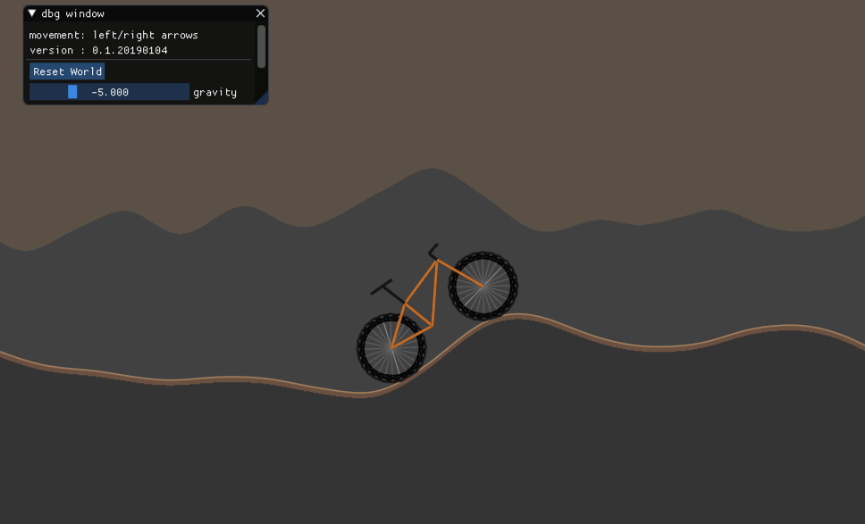

muhucycle
=========

A proto-game. Compiled for the web to WebAssembly using emscripten. Total download size is less than 400kB.

Latest demo: http://fdkz.net/tests/muhu/muhu.html

Build muhucycle
---------------

Install emscripten SDK: https://webassembly.org/getting-started/developers-guide/

Activate the emscripten SDK environment, and .. should compile everywhere.

### MacOS (tested on Mojave)

    compile-wasm-debug.sh
    compile-wasm-release.sh

Credits/dependencies
--------------------

All dependencies are included.

  * [https://github.com/ocornut/imgui](https://github.com/ocornut/imgui) the fabulous "dear imgui"
  * [https://github.com/floooh/sokol](https://github.com/floooh/sokol) minimal cross-platform standalone C headers
